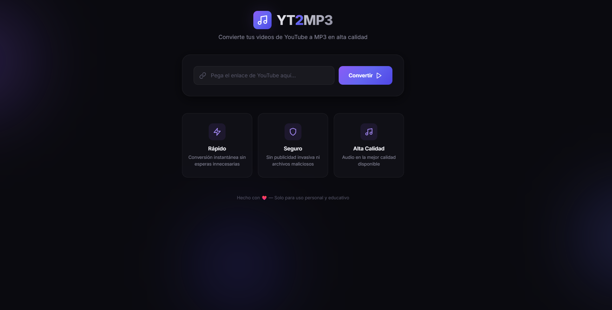
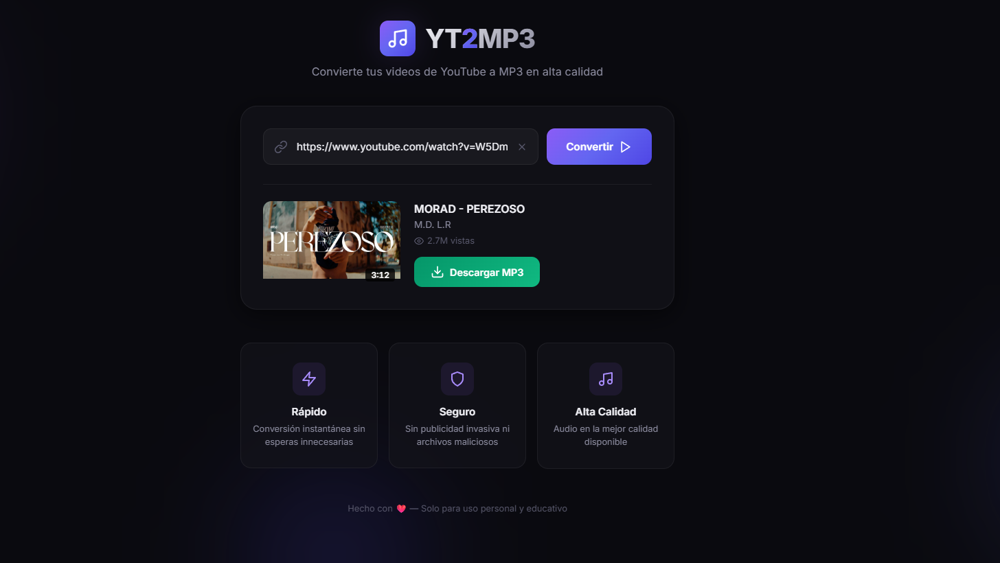
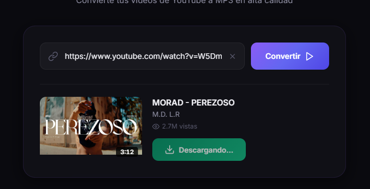
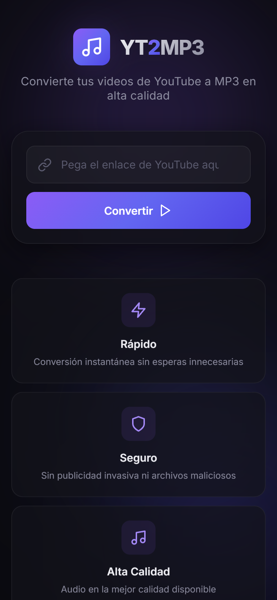

# 🎵 YT2MP3 — YouTube to MP3 Converter

### Fast, clean audio extraction from any YouTube video — no ads, no tracking, no nonsense

---

## 📖 About the Project

**YT2MP3** is a minimal, self-hosted web application that converts any YouTube video into a high-quality MP3 file in just a few clicks.

The project addresses a simple frustration: most online converters are riddled with pop-up ads, impose file size limits, or outright fail on longer videos. This tool runs entirely on your own machine using **yt-dlp** and **ffmpeg** under the hood, giving you the best audio quality available while keeping full control of your data.

---

## 🖥️ The Interface

A single, focused page: paste a YouTube link, preview the video details, and download.


> **Fig 1.** *Home Screen: Dark glassmorphism UI with animated background. Supports youtube.com, youtu.be, Shorts, and mobile links.*

---

## 🔍 Video Preview

Before downloading, the app fetches the video's metadata and displays a preview card so you always know what you're converting.


> **Fig 2.** *Preview Card: Thumbnail, title, channel name, duration badge, and view count — all pulled live from YouTube before any download starts.*

---

## ⬇️ Download Flow

Once you confirm the video, the server extracts the audio stream, converts it to MP3 at the best available quality, and streams it directly to your browser — no file is left on the server after the transfer completes.


> **Fig 3.** *Download in progress: The button updates its state while the conversion runs server-side. The temp file is cleaned up automatically after delivery.*

---

## 📱 Responsive Design

The interface adapts seamlessly to any screen size, making it just as usable on mobile as on desktop.


> **Fig 4.** *Mobile layout: The input group and feature cards stack vertically. The clipboard auto-paste feature works on mobile browsers too.*

---

## ⚙️ How It Works

```
User pastes URL
      │
      ▼
 [Frontend] validates URL format (regex patterns)
      │
      ▼
 GET /api/info?url=...
      │
      ▼
 [Server] runs yt-dlp --dump-json
      │
      ▼
 Returns: title, author, thumbnail, duration, views
      │
      ▼
 User clicks "Descargar MP3"
      │
      ▼
 GET /api/download?url=...
      │
      ▼
 [Server] runs yt-dlp --extract-audio --audio-format mp3 --audio-quality 0
      │
      ▼
 MP3 streamed to browser → temp dir cleaned up
```

### Key behaviours
- **Auto-paste from clipboard:** On input focus, if the clipboard contains a valid YouTube URL it is pasted automatically.
- **Client disconnect handling:** If the user closes the tab mid-download, the server kills the yt-dlp process and cleans up the temp file immediately.
- **URL support:** `youtube.com/watch`, `youtube.com/shorts`, `youtu.be`, `youtube.com/embed`, `m.youtube.com`.

---

## 🛠️ Technologies Used

| Layer | Technology |
| :--- | :--- |
| **Frontend** | Vanilla HTML5, CSS3 (custom properties, glassmorphism, CSS animations), Vanilla JavaScript (ES2022) |
| **Backend** | Node.js, Express 4 |
| **Audio extraction** | [yt-dlp](https://github.com/yt-dlp/yt-dlp) + ffmpeg |
| **Design** | Inter font, animated radial-gradient blobs, `backdrop-filter: blur` |

---

## 🚀 Getting Started

### Prerequisites

- **Node.js** 18+
- **yt-dlp** — install via winget: `winget install yt-dlp`
- **ffmpeg** — install via winget: `winget install ffmpeg`

### Installation

```bash
git clone https://github.com/alejandrobtez/converter.git
cd converter
npm install
```

### Run

```bash
npm start
```

Open [http://localhost:3000](http://localhost:3000) in your browser.

---

## 📁 Project Structure

```
converter/
├── server.js          # Express server, /api/info and /api/download endpoints
├── package.json
└── public/
    ├── index.html     # Single-page app markup
    ├── style.css      # All styles — variables, layout, animations
    └── app.js         # Client-side logic — fetch, preview, download trigger
```

---

## ⚠️ Disclaimer

This tool is intended for **personal and educational use only**. Only download content you own or have permission to download. Respect YouTube's [Terms of Service](https://www.youtube.com/t/terms) and copyright law.

---

## 👨‍💻 Hecho por alejandrobtez

<div align="center">


### Alejandro Benítez

[](https://github.com/alejandrobtez)
[](mailto:alejandrobenitez91203@gmail.com)

</div>

---

<div align="center">

| | |
|:---|:---|
| 🎓 **Formación** | Máster en Inteligencia Artificial & Big Data |
| 💻 **Rol** | Full Stack Developer |
| 🔧 **Especialidad** | Web tooling, automatización y proyectos con IA |
| 🌍 **Ubicación** | España |
| 🚀 **Actualmente** | Construyendo herramientas prácticas que resuelven problemas reales |

</div>

---

**Stack habitual:**


<div align="center">

[](https://github.com/alejandrobtez)

</div>

---

## 📄 License

This project is licensed under the MIT License - see the [LICENSE](LICENSE) file for details.
